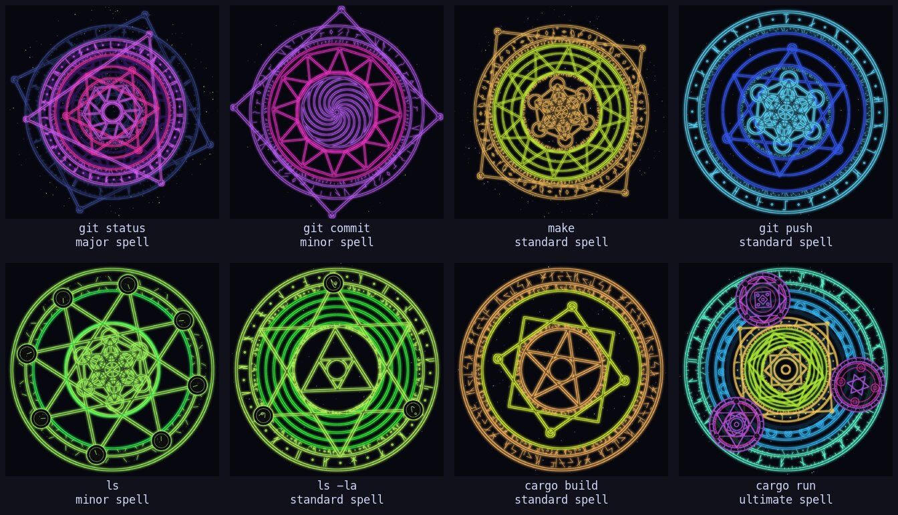

# maho

[English](README.md) | 日本語

**いつものコマンドを、魔法として唱える。**

`maho` はどんな CLI コマンドの前にも付けられるラッパーです。コマンドを実行する前に、
そのコマンド専用の魔法陣を端末に展開します。


```console
$ maho git status
```

- **同じ呪文からは、必ず同じ魔法陣が出ます。**魔法陣はコマンド文字列の SHA-256 から決まります。
  `git status` を唱えれば、いつでもどのマシンでもこの紫の三角が出ます
- **1 文字違えば、まったく別の魔法陣になります。**`ls` と `ls -la` は似ても似つきません
- **円に書かれた文字はコマンドそのものです。**帯に並ぶ架空の魔法文字は、
  唱えたコマンドを 1 バイトずつ書いたものです。同じ文字はどの魔法陣でも同じ字形になります
- **魔法には格があります。**コマンドごとに小魔法・中魔法・大魔法・極大魔法のどれかが決まり、
  魔法陣は端末の 8 行から 36 行まで大きくなります。大きいものほど出にくくなっています
- **仕事の邪魔はしません。**展開はおよそ 1 秒で、演出はすべて stderr に出ます。
  stdout・終了コード・パイプはそのままコマンドのものです



## インストール

```sh
cargo install --git https://github.com/yukihirop/maho
```

## 使い方

```sh
maho git status
maho cargo build --release
maho "cargo build && ls"      # 空白を含む引数 1 つはシェル（sh -c）に渡す
```

| オプション | 意味 |
| --- | --- |
| `--explain` | 魔法陣のハッシュと、そこから引いたパラメータを表示する |
| `--svg <file>` | 魔法陣を SVG に書き出す |
| `--share` | コマンドは実行せず、X などに貼る投稿文と画像を作る |
| `--locale <ja\|en>` | 今回だけ表示の言語を変える |
| `--setup` | 設定を表示する。`--locale` と一緒なら、その言語を保存する |
| `--grimoire` | 図鑑を開く。これまでに集めた魔法陣の種類を見る |

オプションはコマンドより前にだけ置けます。`maho cargo --explain E0308` の `--explain` は cargo のものです。

```console
$ maho --explain git status
✦ 魔法陣展開: git status
  hash      e62b04aadf39df1a47b771265e4ae5c452df3f1903d5c263ab00f088e86102f6
  tier      大魔法
  layout 突破  shape 車輪  ornament 星形  rings 5  symmetry 3  runes 27  particles 398
  script 点文字  size 1.12  spacing 0.37  separator なし  band ルーン
  rotation 265.3°  hue 288.8°  右回り
```

### ここぞというときに唱える

コマンドはエージェントが秒で打ってくれる時代です。`maho` は、人間があえて手で唱え、1 秒待って
魔法陣を眺めるための無駄です。無駄はたまにやるから贅沢なので、全部のコマンドに付けるより、
節目のコマンドにだけ付けるのがおすすめです。

```sh
alias push='maho git push'          # 仕上げた変更を送り出すとき
alias release='maho git tag'        # リリースのタグを打つとき
alias deploy='maho make deploy'     # 本番に出すとき
```

引数も呪文のうちなので、`release v1.2.0` と `release v1.3.0` では魔法陣も格も変わります。
極大魔法を引いたリリースは、きっと縁起がいいはずです。どうしても毎回見たいなら
`alias git='maho git'` もできますが、1 秒の待ちが積み重なることはお忘れなく。

### 魔法陣を見せびらかす

```console
$ maho --share git status | pbcopy
```

コマンドは実行しません。投稿文を stdout に、1200px の画像（`maho-<ハッシュ先頭8桁>.png`）を
今のディレクトリに書き出し、投稿文が入った X の投稿画面の URL を stderr に出します。画像は手で添えてください。

```text
「git status」を唱えたら、大魔法の魔法陣が展開した ✦

突破の陣 / 車輪 / 星形 / 3 回対称
呪紋 e62b04aa

#maho
https://github.com/yukihirop/maho
```

### 表示の言語

メッセージ・図形の名前・投稿文は、日本語と英語を切り替えられます。

```sh
maho --setup --locale ja   # 日本語を保存する
maho --setup               # 今の言語と、それがどこから決まったかを表示する
maho --locale en ls        # 今回だけ英語
```

決まる順番は `--locale` > `MAHO_LOCALE` > 設定ファイル
（`$XDG_CONFIG_HOME/maho/config`、無ければ `~/.config/maho/config`）> `LC_ALL` / `LC_MESSAGES` / `LANG`
（`ja` で始まれば日本語）> 英語 です。

## 魔法の格

| 格 | 高さ | 出る確率 |
| --- | --- | --- |
| 小魔法 | 8 行 | 35% |
| 中魔法 | 16 行 | 45% |
| 大魔法 | 24 行 | 19% |
| 極大魔法 | 36 行 | 1% |

格が上がるほど、中身も豪華になります。極大魔法はただ大きいだけではありません。どうなるかは、引いてからのお楽しみです。

格もハッシュから決まるので、同じ呪文は何度唱えても同じ格です。ただし引数も呪文のうちなので、
引数が変われば格も変わります。大魔法と極大魔法を引いたときだけ、魔法陣の下に `✦ 極大魔法` のように名乗ります。

## 図鑑

唱えた魔法陣は図鑑に記録されます。`maho --grimoire` で、格・中心図形・陣形・装飾・対称・書体・外周の帯の
全 38 種のうち、どこまで集めたかを見られます。まだ出会っていないものは `？？？` で伏せてあります。

```
✦ 魔法陣図鑑  17 / 38  ████████░░░░░░░░░░░░  44%
  唱えた呪文 3 種 / 延べ 3 回

  格            2/4  ？？？  中魔法 2  大魔法 1  ？？？
  中心図形     2/12  ？？？  三角  ？？？  ？？？  ？？？  ？？？  入れ子多角形  ？？？  ？？？  ？？？  ？？？  ？？？
  陣形          3/3  標準  大星  突破
  ...
  骨格        3/144  中心図形 × 陣形 × 格
```

唱えて新しいものが埋まると、魔法陣の下に `✦ 図鑑に記録: 大魔法 / 入れ子多角形` のように出ます。
38 種が埋まったら、次は骨格（中心図形 × 陣形 × 格、全 144 種）集めです。装飾は目に見えたときだけ数えるので、
大星の陣では埋まりません。

組み合わせは全部で約 6,500 万 + α 通りあるので、同じ魔法陣にはまず出会いません。
骨格を揃えるには、別々のコマンドをおよそ 1 万 5 千個唱える計算です。コンプリートは事実上不可能なので、
気長にどうぞ。引数も呪文のうちなので、`git commit -m "..."` はコミットのたびに新しい呪文になります。

図鑑は `$XDG_DATA_HOME/maho/grimoire`（無ければ `~/.local/share/maho/grimoire`）にあります。
残すのはコマンドのハッシュと唱えた回数だけで、コマンドそのものは書きません。

## 魔法陣の決まり方

1. コマンド文字列（引数を空白で連結したもの）の SHA-256 を取る
2. それを種にした乱数（ChaCha8）から、配置・中心図形・装飾・円の数・対称性・ルーン数・
   粒子数・回転・色相・回転方向・呪文の書き方・格を引く
3. 配置は 3 種、中心図形は 12 種、装飾は 6 種から選ばれる
4. 呪文は 4 種の書体のどれかで、魔法陣ごとの字の大きさと字間で書かれ、繰り返しの切れ目には
   5 種の区切りのどれかが入る。外周の帯は 3 種類ある
5. SVG を組み立て、[resvg](https://github.com/linebender/resvg) で PNG にして端末へ送る。
   外側の帯から内側へ、順に描き上がっていくコマを 16 枚流す

どんな種類があるかは、唱えてからのお楽しみです。出会ったものは `maho --grimoire` の図鑑で確かめられます。

## 対応している端末

| 端末 | 方式 |
| --- | --- |
| Ghostty / Kitty | Kitty graphics protocol |
| iTerm2 / WezTerm | iTerm2 inline images |
| それ以外 / tmux の中 | 画像は出さず、`✦ 魔法陣展開: <コマンド>` の 1 行だけ |

stderr が端末でないとき（リダイレクト中など）は何も出しません。

| 環境変数 | 意味 |
| --- | --- |
| `MAHO_GRAPHICS=kitty\|iterm\|none` | 自動判定をやめて方式を固定する |
| `MAHO_ANIMATION=off` | 展開アニメーションをやめ、完成図 1 枚だけ出す |
| `MAHO_LOCALE=ja\|en` | 設定ファイルより優先して、この言語で表示する |
| `MAHO_GRIMOIRE=off` | 唱えた魔法陣を図鑑に記録しない |

## README の画像を作り直す

`assets/` の GIF とギャラリーは、`maho` が実際に端末へ送った画像を抜き出して、
ターミナルの枠とコマンドの出力を描き足したものです（コマンド自体は偽物に差し替えて走らせません）。

```sh
python3 scripts/demo.py   # cargo, ImageMagick, script(1) が要る
```
